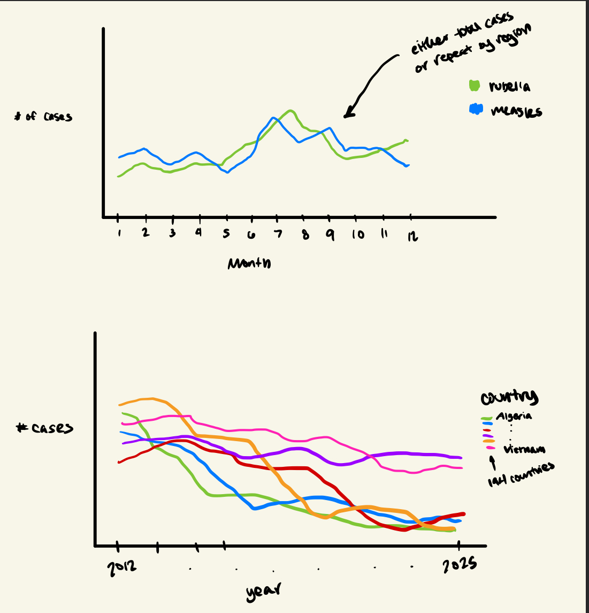

```{r}
#| include: false
library(tidyverse)
library(here)
library(readxl)
library(janitor)
library(gt)
```

```{r}
#| include: false
cases_month <- readr::read_csv('https://raw.githubusercontent.com/rfordatascience/tidytuesday/main/data/2025/2025-06-24/cases_month.csv')
cases_year <- readr::read_csv('https://raw.githubusercontent.com/rfordatascience/tidytuesday/main/data/2025/2025-06-24/cases_year.csv')
```

```{r}
#| include: false
str(cases_month)
str(cases_year)
```

# Project Checkpoint 1

## Data Context

This data describes the number of measles and rubella cases from 194 countries. It documents cases each month and year from January 2012 to July 2025. It is provided by the World Health Organization (WHO). Member states report this information to WHO as part of the WHO UNICEF annual data collection exercise. This data is used for investigation into monthly cases and is of interest for monitoring immunization.

## Data Cleaning

The two data sets were cleaned separately. For the month dataset, column names were renamed using the janitor package. The content of each name is the same, it is just renamed in snake case. The data is also read in to ensure that all columns but region, country, and iso3 (country code) are numeric. No variables are created or modified otherwise.

The cases by year dataset is cleaned in a bit more detail. First, the first row becomes the column names. Then, column names are renamed using snake case so that they can easily be renamed to match the month dataset. The columns country, iso3, measles_total, measles_lab_confirmed, measles_epi_linked, measles_clinical, rubella_total, rubella_lab_confirmed, rubella_epi_linked, and rueball_clinical were renamed from member_state, iso_country_code, number_of_measles_cases_by_confirmation_method, na, na_2, na_3, number_of_rubella_cases_by_confirmation_method, na_4, na_5, and na_6 respectively. No other datatypes were changed and no variables were created.

## Research Questions with Original Data

1.  Are certain countries showing more improvement in containing measles and rubella cases in recent years more than others?
2.  Is there a time of year where measles and rubella cases become more common globally?
3.  What proportion of suspected measles cases are discarded, and does this vary by region (in a single year)?
4.  Do Epidemiologically-linked cases make more of total confirmed cases compared to clinically-compatible cases, and does this differ between measles and rubella?

## Research Questions with Supplemental Data

1.  Is there a consistently noticeable gap in monthly rubella cases between countries that have introduced the rubella vaccine and countries that have not?
2.  How long does it take for measles and rubella cases to noticeably drop after countries introduce vaccinations?
3.  Are countries with lower vaccination rates associated with higher measles incidence rates per million population?
4.  Do countries with lower GDP or weaker healthcare access have a higher proportion of clinically-compatible cases relative to lab-confirmed cases, meaning possibly limited diagnostic capacity?

## Data Visualization Sketches



# Project Checkpoint 2

### Months with highest measles case count each year:

*No new columns*

*Custom function and iteration*

```{r}
# function to get the month of a year with the highest number of cases
max_month <- function(yr){
  cases_month |>
    filter(year == yr) |>
    group_by(month) |>
    summarize(num_measles = sum(measles_total, na.rm = TRUE)) |>
    slice_max(n=1, order_by = num_measles)
}

cases_year |>
  distinct(year) |>
  # apply function to each year in the data
  mutate(max_month = map(year, max_month)) |>
  # pull out columns from map
  unnest(max_month) |>
  # convert month abbreviations to month names
  mutate(month = month.name[month]) |>
  # make a gt table object
  gt() |>
  # rename and bold each column
  cols_label(
    year = md("**Year**"),
    month = md("**Month**"),
    num_measles = md("**Cases**")
  ) |>
  # add a table title
  tab_header(title = md("Time of Year with Increased Measles Cases Over Time")) |>
  # add a table caption
  tab_caption(caption = md("Months with the Highest Number of Cases."))
```

### Epidemiologically-linked case proportions by region and year

*Modified columns*

*Custom function and iteration*

```{r}
# function to get proportion of cases that are epidemiologically-linked for each year in one region
epi_proportions <- function(region) {
  cases_month |>
    filter(region == region) |>
    group_by(year) |>
    # get total counts for each year
    summarise(
      # measles total epidemiologically-linked and lab confirmed
              measles_epi_linked = sum(measles_epi_linked, na.rm = TRUE),
              measles_lab_confirmed = sum(measles_lab_confirmed, na.rm = TRUE),
      # rubella total epidemiologically-linked and lab confirmed     
              rubella_epi_linked = sum(rubella_epi_linked, na.rm = TRUE),
              rubella_lab_confirmed = sum(rubella_lab_confirmed, na.rm = TRUE)) |>
    # modify columns by calculating proportions
    mutate(prop_epi_measles = measles_epi_linked / measles_lab_confirmed,
           prop_epi_rubella = rubella_epi_linked / rubella_lab_confirmed) |>
    select(year,
           prop_epi_measles,
           prop_epi_rubella)
}

 cases_year |>
  distinct(region) |>
  # apply function to get proportions for each region
  mutate(epi_props = map(region, epi_proportions)) |>
  # get columns from returned map lists
  unnest(epi_props) |>
  # group by region so the table is divided by region
  group_by(region) |>
  # make a gt table
  gt() |>
   # format the proportion columns to be percents 
   fmt_percent(columns = matches("prop"), decimals = 1) |>
   # rename and bold column names
    cols_label(
      region = md("**Region**"),
      year = md("**Year**"),
      prop_epi_measles = md("**Epidemiologically-linked measles cases**"),
      prop_epi_rubella = md("**Epidemiologically-linked rubella cases**")
    ) |>
   # add a table title
   tab_header(
     title = md("Proportion of Confirmed Cases that are Epidemiologically-linked"),
   ) |>
   # add a table caption
   tab_caption(
     caption = md("Changes in each region's confirmed case makeup over time.")
   )
  
```
